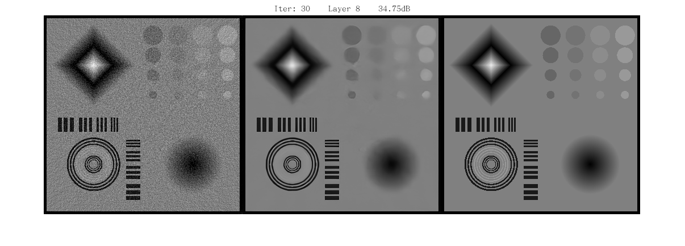

# Statistical Iterative CBCT Reconstruction Based on Neural Network

This is an implementation of [our article]() on matlab, matconvnet. 

<div align="center">  </div><br>

The repository includes:

- data：this folder includes CS phantom projection with $5e^3$ incident photon and original CS phantom without noise. 


- cpp：this folder includes 3D-Projection process：based on [3D Forward and Back-Projection for X-Ray CT Using Separable Footprints](https://www.ncbi.nlm.nih.gov/pmc/articles/PMC2993760/)（compiled files --- `updateu_method_cs.mexa64` for linux and `updateu_method_cs.mexw64` for windows）
- models：this folder includes trained model
- eval：this folder includes PSNR, SSIM, ISNR functions（our paper use this version evaluation）
- utilities：this folder includes extra functions（e.g. load trained model function）
- Cal_Deblur.m：deblur functions（wrap the denoise phase）
- iter_cs.m：demo of CS Phantom 

## Preparation

### Prerequisites

- matlab（tested on matlab16b(linux)）
- [matconvnet](http://www.vlfeat.org/matconvnet/)：please reference the official installation instructions to install it

### Get Starts

step1：clone the code

```shell
git clone https://github.com/HUST-Shan/Deblur-CBCT.git
cd Deblur-CBCT
```

step2：run CS phantom demo

```matlab
iter_cs
```

（Note: 1. You can find the results in result folder.  2. the demo do deblur in middle layer, you can apply it in all the layer as well.）

## Some Explainations

1. This pre-trained model is coming from [IRCNN](https://github.com/cszn/IRCNN)：the denoise network is a little different from our article, however, you can replace the denoise network with "any denoise network or methods"（we will release a trainable model in our python version）
2. We will upload more simulation digital phantoms soon.
3.  We will release a python version soon（Containing training phase.）

## Citation

```
@article{Deblur-CBCT
    Author = {Binbin Chen, Kai Xiang, Zaiwen Gong, Jing Wang*, Shan Tan*},
    Title = {Statistical Iterative CBCT Reconstruction Based on Neural Network},
    Journal = {Transactions on Medical Imaging},
    Year = {2017}
} 
```

